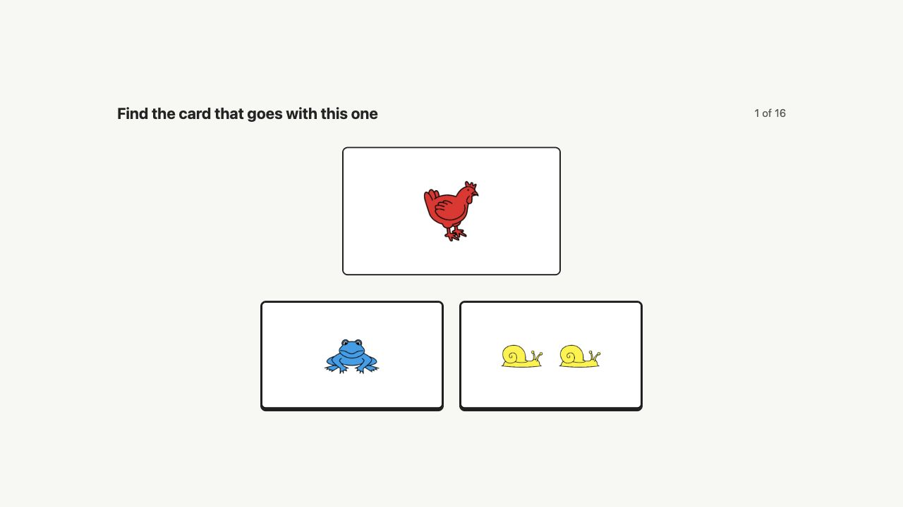
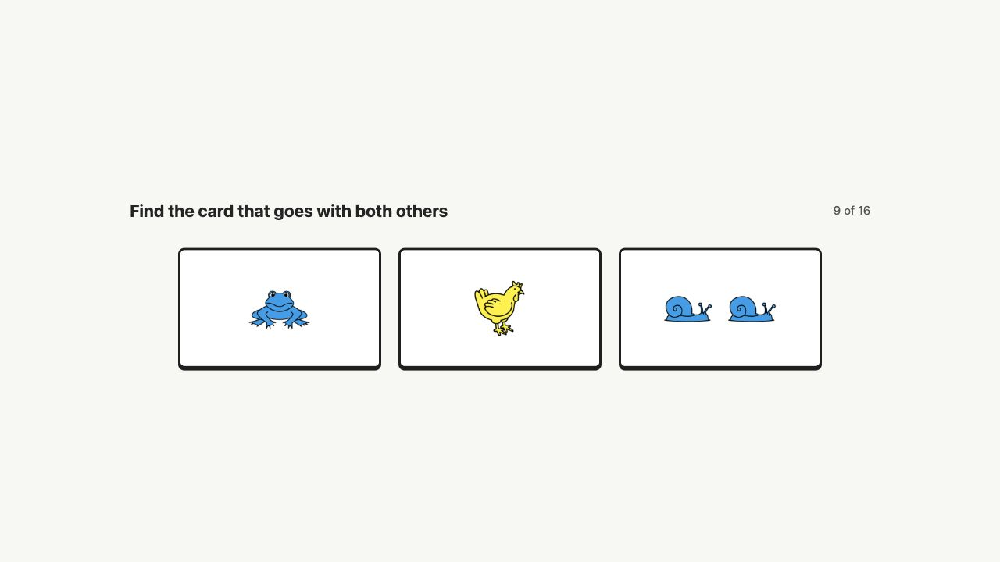
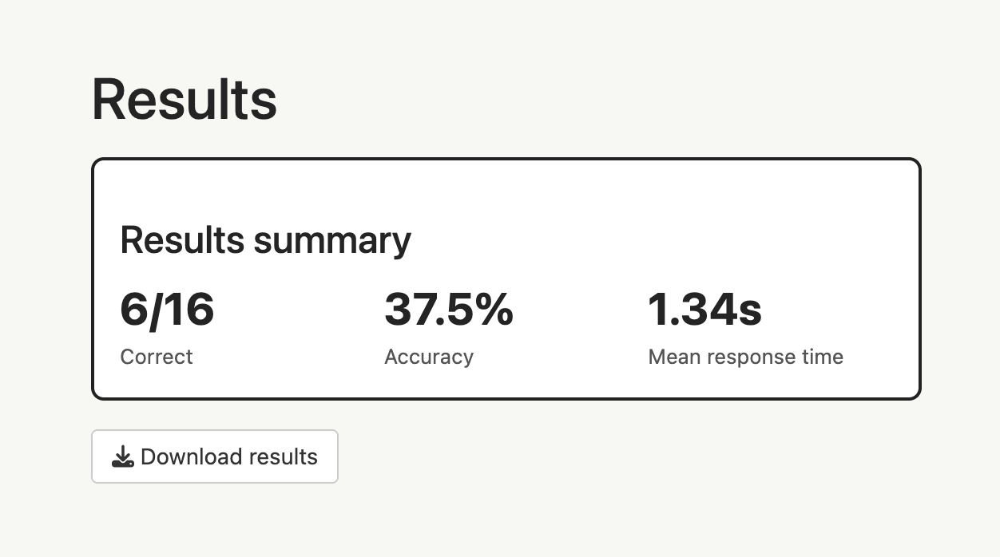

```{r, include = FALSE}
knitr::opts_chunk$set(
  collapse = TRUE,
  comment = "#>",
  fig.align = "center"
)

pkg_root <- normalizePath("..", mustWork = FALSE)
if (file.exists(file.path(pkg_root, "DESCRIPTION")) &&
    requireNamespace("pkgload", quietly = TRUE)) {
  pkgload::load_all(pkg_root, quiet = TRUE)
}

card_img <- function(path, alt, correct = FALSE, margin_right = FALSE) {
  border <- if (correct) "5px solid #0b6bcb" else "2px solid #222"
  margin <- if (margin_right) " margin-right: 20px;" else ""

  sprintf(
    '',
    knitr::image_uri(path),
    alt,
    border,
    margin
  )
}

card_display <- function(bottom, top = NULL) {
  top_html <- if (is.null(top)) {
    ""
  } else {
    sprintf('<div style="margin-bottom: 12px;">%s</div>', top)
  }

  sprintf(
    '<div style="text-align: center;">%s<div>%s</div></div>',
    top_html,
    paste0(bottom, collapse = "")
  )
}
```

## Project aim

The `fistcards` package provides an online version of the FIST card task.
It defines the stimulus deck, generates valid Phase 1 and Phase 2 trials, scores
responses, and runs a Shiny app for collecting participant data.

The goal of the project is to create a reusable research tool for measuring
cognitive flexibility in young children aged 2 to 7. In the task, children
compare cards that vary on three dimensions: colour, animal, and number. The
online version makes it possible to present the task interactively, record
structured responses, and keep the task logic in testable R functions.

This report describes the final project version. It explains the structure of
the cards, the two task phases, the Shiny app, and the tests used to check the
main logic.

## Package structure

The project is organized as an R package so that the task logic, app, images,
tests, and documentation can be installed and reused together.

- `R/cards.R` creates the card deck, image paths, and card lookup helper.
- `R/card_logic.R` compares cards and identifies correct choices.
- `R/trials.R` generates valid trials for both task phases.
- `R/run_fist_game.R` launches the packaged Shiny app.
- `inst/app/app.R` contains the Shiny interface and server logic.
- `inst/app/www/cards` stores the card images used by the app.
- `tests/testthat` contains automated tests for logic, assets, and app flow.

## Card structure

Each card is described by its colour, animal, number, and image path. The full
deck has 27 cards: three colours, three animals, and three numbers.

```{r}
library(fistcards)

cards <- fist_cards()
nrow(cards)
head(cards)
```

The card images are stored inside the package so the app can find them on any
computer after installation. The examples below show three cards from the same
animal category.

```{r card-examples, echo = FALSE, out.width = "24%"}
example_cards <- c("blue_frog_1.png", "red_frog_2.png", "yellow_frog_3.png")
example_paths <- system.file(
  "app", "www", "cards", example_cards,
  package = "fistcards"
)

knitr::include_graphics(example_paths)
```

## Phase 1

In Phase 1, children see one target card and two possible answer cards. The
correct answer is the card that shares exactly one dimension with the target
card. The distractor card shares no dimensions with the target card. The two
answer options are also kept fully distinct from each other, so they do not share
colour, animal, or number.

Phase 1 rule:

- correct choice: shares exactly one feature with the target
- distractor: shares zero features with the target
- answer options: share zero features with each other

```{r}
phase1_trials <- generate_phase1_trials(n = 5, seed = 1)
phase1_trials
```

The scoring helper returns the position of the correct choice.

```{r}
target <- list(colour = "blue", animal = "frog", number = 1)
choice1 <- list(colour = "yellow", animal = "frog", number = 3)
choice2 <- list(colour = "red", animal = "snail", number = 2)

correct_phase1_choice(choice1, choice2, target)
```

The target card here is the "one blue frog". The "three yellow frogs" card is
correct because it shares only animal with the target, while the "two red
snails" card shares no features with the target. In the example below, the
target card is shown above the two answer options. The blue outline marks the
correct answer.

```{r phase1-picture, echo = FALSE, results = "asis"}
phase1_target <- system.file(
  "app", "www", "cards", "blue_frog_1.png",
  package = "fistcards"
)
phase1_correct <- system.file(
  "app", "www", "cards", "yellow_frog_3.png",
  package = "fistcards"
)
phase1_distractor <- system.file(
  "app", "www", "cards", "red_snail_2.png",
  package = "fistcards"
)

cat(card_display(
  top = card_img(phase1_target, "Target card: one blue frog"),
  bottom = c(
    card_img(
      phase1_correct,
      "Correct answer: three yellow frogs",
      correct = TRUE,
      margin_right = TRUE
    ),
    card_img(phase1_distractor, "Incorrect answer: two red snails")
  )
))
```

## Phase 2

In Phase 2, children see three cards and choose the special card. A valid
special card shares exactly one dimension with one card and exactly one
different dimension with the other card. The two non-special cards do not share
any dimensions with each other.

Phase 2 rule:

- special card: shares exactly one feature with each other card
- shared dimensions: must be different
- non-special cards: share zero features with each other

```{r}
phase2_trials <- generate_phase2_trials(n = 5, seed = 1)
phase2_trials
```

The scoring helper returns which of the three cards is the special card.

```{r}
special_card <- list(colour = "red", animal = "frog", number = 1)
animal_match <- list(colour = "blue", animal = "frog", number = 2)
colour_match <- list(colour = "red", animal = "snail", number = 3)

correct_phase2_choice(special_card, animal_match, colour_match)
```

In the pictured Phase 2 example, the "one red frog" card is the special card.
It shares animal with the "two blue frogs" card and colour with the "three red
snails" card. The blue outline marks the correct answer: the card that goes
with both of the other cards.

```{r phase2-picture, echo = FALSE, results = "asis"}
phase2_special <- system.file(
  "app", "www", "cards", "red_frog_1.png",
  package = "fistcards"
)
phase2_animal_match <- system.file(
  "app", "www", "cards", "blue_frog_2.png",
  package = "fistcards"
)
phase2_colour_match <- system.file(
  "app", "www", "cards", "red_snail_3.png",
  package = "fistcards"
)

cat(card_display(c(
  card_img(
    phase2_special,
    "Correct answer: one red frog",
    correct = TRUE,
    margin_right = TRUE
  ),
  card_img(
    phase2_animal_match,
    "Comparison card: two blue frogs",
    margin_right = TRUE
  ),
  card_img(phase2_colour_match, "Comparison card: three red snails")
)))
```

## Trial generation

Trials are not manually entered one by one. The package generates card
combinations from the full deck and keeps only those that satisfy the task
rules.

For Phase 1, the generator loops through possible target cards, matching cards,
and distractors. It uses `correct_phase1_choice()` to keep trials where exactly
one choice shares one feature with the target and the other choice shares none.

For Phase 2, similarly, the generator checks three-card combinations with
`correct_phase2_choice()`. A combination is kept only when exactly one card fits
the special-card rule: it shares exactly one feature with each of the other two
cards, those shared features are different, and the other two cards share no
features with each other.

This rule-based approach helps prevent invalid trials and keeps the Shiny app
from relying on hand-coded answers.

## Shiny app

The interactive version can be launched from R:

```{r, eval = FALSE}
remotes::install_github(
  "Programming-The-Next-Step-2026/fist-cards",
  subdir = "fistcards"
)

library(fistcards)
run_fist_game()
```

When working with a downloaded copy of the project, the package can be loaded
directly from the local files:

```{r, eval = FALSE}
devtools::load_all("fistcards")
run_fist_game()
```

In the app, the researcher first enters the participant ID and chooses how many
trials to run in each phase. The participant then moves through the instruction
screens, completes the card choices, sees a thank-you screen, and can then view
the results summary and download the response data.

The workflow separates the researcher and participant roles. The researcher
configures the session and downloads the data, while the child participant only
interacts with the card-choice screens.

The app currently includes:

- a participant ID field
- configurable trial counts for Phase 1 and Phase 2
- introductory example screens before each phase
- clickable card choices
- response recording with accuracy and reaction time
- a thank-you screen after the final trial
- a separate results screen with a summary and CSV download

In a Phase 1 trial, the target card is shown at the top and the two answer
choices are shown below it.

```{r shiny-app-screenshot, echo = FALSE, out.width = "80%"}

```

In a Phase 2 trial, the participant sees three cards and chooses the special
card that matches the other two cards in different ways.

```{r shiny-phase2-screenshot, echo = FALSE, out.width = "80%"}

```

After the participant finishes the task, the final results screen shows the
score summary and provides the CSV download button.

```{r shiny-results-screenshot, echo = FALSE, out.width = "80%"}

```

## Data output

The Shiny app stores one row per response. The downloaded CSV includes:

- `participant_id`: anonymous ID entered by the researcher
- `phase`: task phase
- `trial_id`: generated trial identifier
- `trial_number`: order of the trial in the session
- `cards_shown`: card IDs presented on that trial
- `correct_choice`: correct button position
- `chosen_choice`: participant's selected button position
- `accuracy`: whether the response was correct
- `reaction_time`: time in seconds from trial display to response
- `timestamp`: response time

These columns allow researchers to summarize accuracy and response time by
participant, phase, or trial.

## Testing and continuous integration

The package uses `testthat` unit tests for the card logic, trial generators,
image assets, app helper functions, and Shiny click-through behavior. These
tests check that the card deck is complete, image files exist, scoring helpers
return the expected answers, generated trials follow the formal task rules, and
the app can move through the main participant flow in a browser.

The Shiny click-through test also checks the final app sequence: after the last
trial, the participant first sees a thank-you screen, then clicks Next to view
the results summary and download the CSV file.

The repository also includes an automatic check on GitHub. When changes are
uploaded, GitHub tests whether the package still installs and runs correctly.

If working from the main project folder, the tests can be run with:

```{r, eval = FALSE}
devtools::test("fistcards")
```

If working from inside the package folder itself, the same tests can be run with:

```{r, eval = FALSE}
devtools::test()
```

## Conclusion

The final version of `fistcards` provides a reusable implementation of the FIST
card task as an installable R package. It combines rule-based trial generation,
tested scoring logic, a child-facing Shiny interface, packaged image stimuli,
and downloadable response data. The project therefore moves the task from a
static set of materials to a reproducible software tool that can be extended for
future research use.
